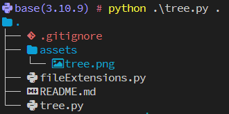

# 关于 MyTools

一些有趣的 Python 脚本，或许可以提高工作效率，也可能仅仅是用来摸鱼。可以将这个仓库添加为环境变量 `MYTOOLS` ，方便随时调用。

以 `tree.py` 为例，添加环境变量后（记得重启电脑），在 Windows 和 Linux 系统下，你可以这样调用这个工具：

## Windows:

```pwsh
python $env:MYTOOLS/tree.py . -d 3
```

## Linux:

```bash
python3 $MYTOOLS/tree.py . -d 3
```

# 工具介绍

## tree.py

这个工具主要用来生成指定路径的树状图，对不同的文件有图标和颜色渲染，也支持自定义修改。

### 准备工作

- 安装 [Nerd Font](https://www.nerdfonts.com/#home)，并修改你的终端用 Nerd Font 渲染;
- 安装 Python 第三方库 [rich](https://github.com/Textualize/rich).

### 使用

```txt
usage: tree.py [-h] [-d DEPTH] path

A simple tree generator

positional arguments:
  path                  The path to the directory

options:
  -h, --help            show this help message and exit
  -d DEPTH, --depth DEPTH
                        The depth of the tree
```



### 自定义

在 `./fileExtension.py` 中，可以修改 `fileIcons` 和 `fileColors` 来扩展文件类型。图标可以在 [Nerd Font Search](https://www.nerdfonts.com/cheat-sheet) 上搜索和复制。

同样的，修改 `./fileExtension.py` 的 `dirIgnore` 变量，可以指定哪些文件夹不被展示。比如添加 `.git` 在 `dirIgnore` 变量中，则绘制树状图时不会迭代 `.git` 文件夹中的内容。